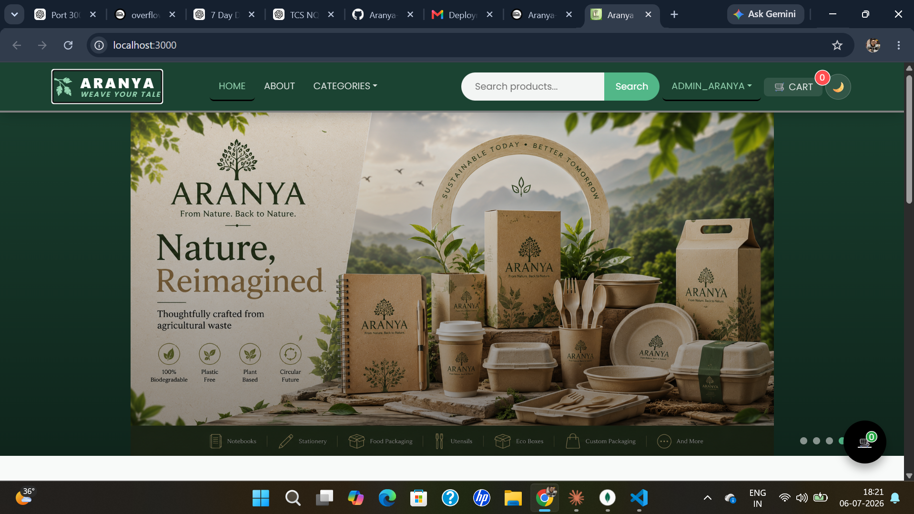
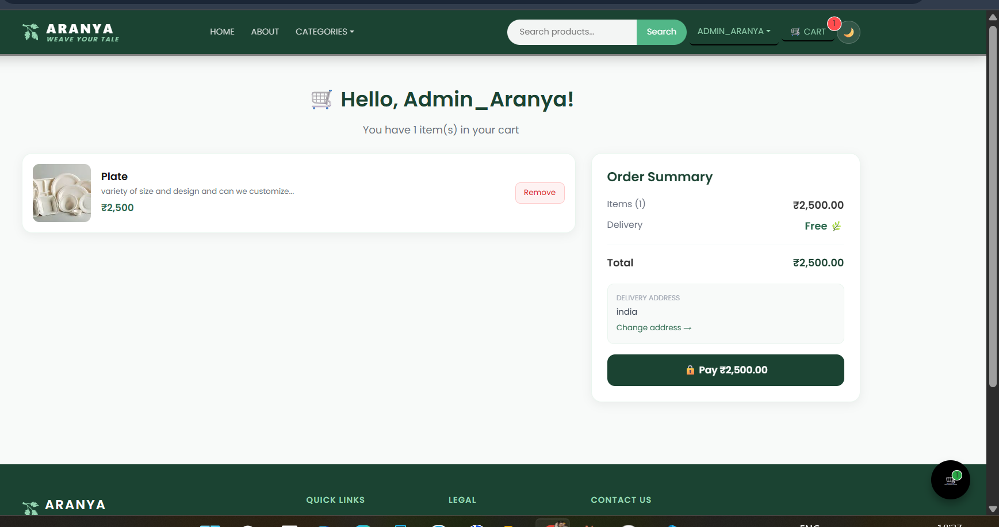
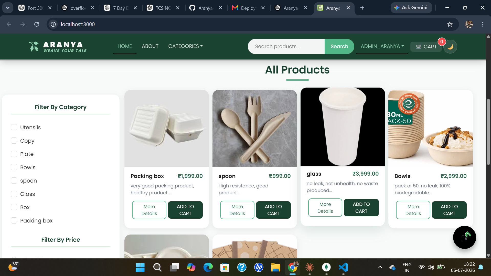
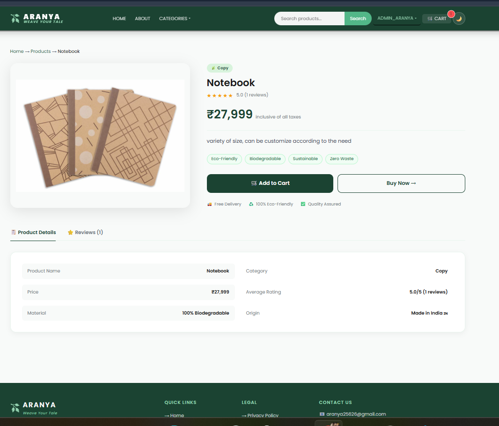
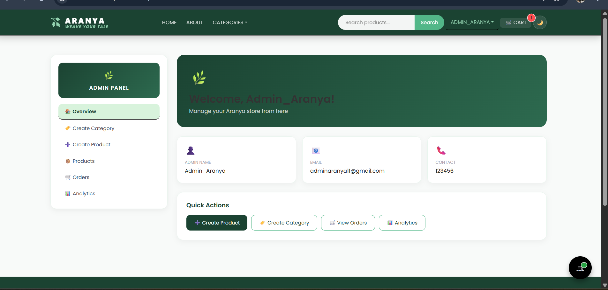
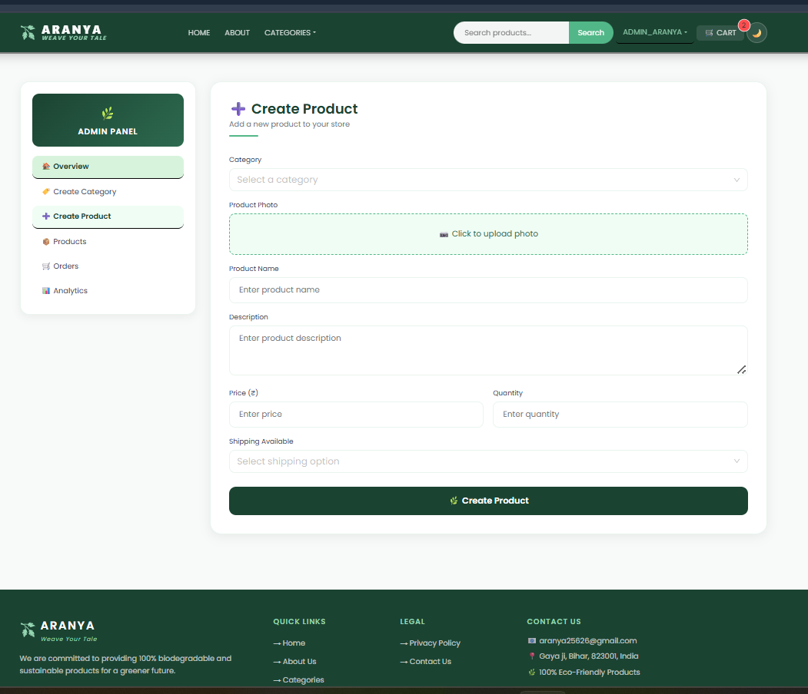
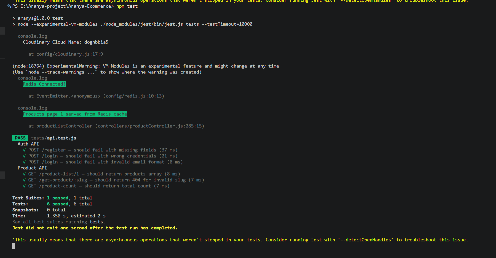

<!-- # 🌿 Aranya — Eco-Friendly E-Commerce Platform

A production-grade full-stack e-commerce platform built with the MERN stack, featuring real-time order tracking, Redis caching, and secure payment processing.

## 🔗 Live Demo
**[View Live →](https://aranya-production.up.railway.app)**

## 📸 Screenshots

| Home | Product |
|------|---------|
|  |  |

| Cart | Admin Dashboard |
|------|-----------------|
|  |  |


## ⚡ Key Features
- **Redis Caching** — 20x faster API response time on product listings
- **Real-time Order Tracking** — Socket.io WebSockets (like Swiggy/Zomato)
- **JWT Refresh Token System** — Secure auth with httpOnly cookies, 15min access tokens
- **Cloudinary Image Upload** — Production-grade image storage (not in DB)
- **Razorpay Payment** — With idempotency check to prevent duplicate orders
- **Email Notifications** — Order confirmation, status updates, delivery alerts via Nodemailer
- **OTP Email Verification** — On registration with 10-min expiry and resend support
- **Admin Analytics Dashboard** — MongoDB Aggregation Pipeline (revenue, top products, order status)
- **Zod Validation** — Backend + frontend validation with error messages
- **Winston Logging** — Production-level logging to files
- **Soft Delete** — Products hidden not deleted (preserves order history)
- **Per-route Rate Limiting** — Strict 5 req/15min on auth routes (brute-force protection)
- **Product Reviews & Ratings** — With star UI and average calculation

## 🛠 Tech Stack
| Layer | Technology |
|-------|-----------|
| Frontend | React.js, Ant Design, Socket.io-client |
| Backend | Node.js, Express.js |
| Database | MongoDB + Mongoose |
| Cache | Redis (ioredis) |
| Auth | JWT (Access + Refresh tokens) |
| Payments | Razorpay |
| Images | Cloudinary |
| Email | Nodemailer |
| Validation | Zod |
| Logging | Winston |
| Containerization | Docker + docker-compose |

## 🚀 Run Locally

### Prerequisites
- Node.js 20+
- MongoDB
- Redis

### With Docker (Recommended)
```bash
git clone https://github.com/yourusername/aranya
cd aranya
cp .env.example .env  # fill in your values
docker compose up
```

### Without Docker
```bash
# Backend
npm install
npm run dev

# Frontend (new terminal)
cd client
npm install
npm start
```

## 🔑 Environment Variables -->


# 🌿 Aranya — Eco-Friendly E-Commerce Platform

<p align="center">


</p>

> A **production-ready full-stack MERN E-Commerce Platform** built with modern web technologies, secure authentication, Redis caching, Cloudinary media storage, Docker support, email verification, admin analytics, and scalable backend architecture.

---

# 🚀 Project Highlights

Unlike a basic CRUD e-commerce project, **Aranya** focuses on building a production-style application using industry practices.

### Key Highlights

- 🔐 Secure JWT Authentication
- 🔄 Refresh Token Authentication
- 📧 Email OTP Verification
- ⚡ Redis Server-side Caching
- ☁️ Cloudinary Image Storage
- 📦 Docker Support
- 📊 Admin Analytics Dashboard
- ⭐ Product Reviews & Ratings
- 💳 Razorpay Payment Integration
- 🔍 Product Search & Filters
- 📂 Category Management
- 📱 Responsive UI
- 📝 Winston Logging
- ✅ Zod Validation
- 📩 Email Notifications
- 🛡 Protected Admin/User Routes

---

# 🎯 Why This Project?

This project was built to simulate a real-world production e-commerce platform instead of a simple college CRUD application.

The application demonstrates concepts commonly used in modern software engineering, including:

- Authentication & Authorization
- REST API Design
- Redis Caching
- Docker Containerization
- Cloud Image Storage
- Secure Payment Processing
- Backend Validation
- Logging & Monitoring
- Scalable Folder Architecture
- Admin Analytics
- Production Deployment Ready Structure

---

# ✨ Features

## 👤 Authentication

- JWT Login
- Secure Registration
- Password Hashing using Bcrypt
- Refresh Token Authentication
- HTTP Only Cookies
- Protected Routes
- Role-based Authorization
- Email OTP Verification
- Resend OTP Support

---

## 🛍 Product Features

- Product Listing
- Product Details
- Category Filter
- Product Search
- Pagination
- Related Products
- Product Reviews
- Product Ratings
- Product Images via Cloudinary

---

## 🛒 Shopping Features

- Shopping Cart
- Quantity Update
- Remove from Cart
- Checkout Flow
- Razorpay Payment
- Order Placement
- Order History

---

## 👨‍💼 Admin Features

- Admin Dashboard
- Product Management
- Category Management
- Order Management
- Revenue Analytics
- Product Analytics
- User Statistics

---

## ⚙ Backend Features

- Redis Caching
- Cloudinary Integration
- Nodemailer
- Winston Logger
- Zod Validation
- REST APIs
- Docker Support
- Environment Configuration
- Error Handling
- Secure Middleware

---

# 🛠 Tech Stack

| Category | Technologies |
|----------|--------------|
| Frontend | React.js, React Router DOM, Axios, Context API, Ant Design, Bootstrap |
| Backend | Node.js, Express.js |
| Database | MongoDB, Mongoose |
| Cache | Redis (ioredis) |
| Authentication | JWT, Bcrypt, HTTP Only Cookies |
| Image Storage | Cloudinary |
| Payment Gateway | Razorpay |
| Email Service | Nodemailer |
| Validation | Zod |
| Logging | Winston |
| Containerization | Docker, Docker Compose |
| Version Control | Git & GitHub |

---

# 🏗 System Architecture

```text
                    React Frontend
                           │
                           │
                   REST API (Axios)
                           │
                           ▼
                 Express.js Backend
                           │
      ┌────────────────────┼────────────────────┐
      │                    │                    │
      ▼                    ▼                    ▼
 MongoDB              Redis Cache         Cloudinary
(Database)         (Fast API Cache)      (Image Storage)
      │
      ▼
 JWT Authentication
      │
      ▼
 Protected APIs
      │
      ▼
 Razorpay + Email Notifications
```

---

# 📂 Project Structure

```text
Aranya-Ecommerce
│
├── client/
│   ├── public/
│   ├── src/
│   │   ├── components/
│   │   ├── context/
│   │   ├── hooks/
│   │   ├── pages/
│   │   ├── styles/
│   │   └── App.js
│
├── config/
│   ├── db.js
│   ├── redis.js
│   ├── cloudinary.js
│   ├── email.js
│   └── logger.js
│
├── controllers/
├── middlewares/
├── helpers/
├── models/
├── routes/
├── tests/
├── docs/
│
├── Dockerfile
├── docker-compose.yml
├── package.json
├── server.js
└── README.md
```

---

# 🚀 Getting Started

## Prerequisites

Before running the project, ensure you have installed:

- Node.js (v18 or above)
- MongoDB
- Redis
- Git
- Docker (Optional)

---

# 📥 Clone Repository

```bash
git clone https://github.com/krish8986/Aranya-Ecommerce.git

cd Aranya-Ecommerce
```

---

# 📦 Install Dependencies

### Backend

```bash
npm install
```

### Frontend

```bash
cd client

npm install
```

---

# ▶ Run the Application

## Backend

```bash
npm run server
```

or

```bash
npm run dev
```

---

## Frontend

```bash
cd client

npm start
```

---

## Run Full Stack

```bash
npm run dev
```

---

# 🐳 Docker Support

Build and start the complete application:

```bash
docker compose up --build
```

Run in background:

```bash
docker compose up -d
```

Stop containers:

```bash
docker compose down
```

---

# 🔐 Environment Variables

Create a `.env` file in the project root.

Example:

```env
PORT=8000

MONGO_URL=

JWT_SECRET=

JWT_REFRESH_SECRET=

REDIS_URL=

CLIENT_URL=http://localhost:3000

EMAIL=

EMAIL_PASSWORD=

CLOUDINARY_CLOUD_NAME=

CLOUDINARY_API_KEY=

CLOUDINARY_API_SECRET=

RAZORPAY_KEY_ID=

RAZORPAY_SECRET=
```

---

# 📡 API Highlights

The backend follows a RESTful API architecture.

### Authentication APIs

- User Registration
- User Login
- Refresh Access Token
- Logout
- Email OTP Verification
- Resend OTP

---

### Product APIs

- Get All Products
- Get Single Product
- Create Product
- Update Product
- Delete Product (Soft Delete)
- Product Search
- Product Filter
- Related Products
- Product Reviews

---

### Category APIs

- Create Category
- Update Category
- Delete Category
- Get Categories

---

### Order APIs

- Place Order
- Get User Orders
- Get All Orders (Admin)
- Update Order Status

---

### Payment APIs

- Razorpay Order Creation
- Payment Verification

---

### Analytics APIs

- Revenue Analytics
- Top Selling Products
- Orders by Status
- Dashboard Statistics

---

# 🔒 Security Features

The project follows several security best practices.

- JWT Authentication
- Refresh Token Authentication
- HTTP Only Cookies
- Password Hashing using Bcrypt
- Protected Routes
- Role-based Authorization
- Environment Variables
- Zod Request Validation
- Centralized Error Handling
- Input Validation
- Secure Payment Verification

---

# ⚡ Performance Optimizations

Instead of serving every request directly from MongoDB, the application improves performance using caching and optimized backend architecture.

### Redis Caching

- Frequently accessed product listings are served from Redis cache.
- Reduces unnecessary database queries.
- Improves response time for repeated requests.

---

### Cloudinary

- Images are stored on Cloudinary instead of MongoDB.
- Faster media delivery.
- Reduced database size.

---

### Docker

- Easy local development.
- Consistent development environment.
- One-command project setup.

---

# 🧪 Testing

The project includes API testing for important backend routes.

Example tested routes:

- Register
- Login
- Product Listing

Run tests using:

```bash
npm test
```

---

# 📸 Screenshots

## 📸 Screenshots

### 🏠 Home Page


### 🛍️ Products


### 📦 Product Details


### 🛒 Shopping Cart


### 📊 Admin Dashboard


### ⚙️ Admin Products


###    Jest + Supertest 


Example:

```text
docs/
└── screenshots/
    ├── home.png
    ├── products.png
    ├── cart.png
    ├── login.png
    ├── admin-dashboard.png
    └── analytics.png
```

---

# 🚀 Deployment

The project is deployment-ready.

### Frontend

- Vercel

### Backend

- Railway
or
- Render

### Database

- MongoDB Atlas

### Cache

- Redis Cloud

### Image Storage

- Cloudinary

---

# 🌟 Production Features

This project includes production-oriented features commonly used in scalable applications.

- Docker Containerization
- Redis Caching
- Cloudinary Storage
- Secure Authentication
- Email Verification
- Logging
- Validation
- Payment Gateway
- Analytics Dashboard
- Environment Configuration
- RESTful APIs
- Modular Architecture

---

# 🛣 Roadmap

The following features are planned for future releases.

- AI Product Recommendation System
- Wishlist
- Coupon & Discount System
- Inventory Management
- Sales Reports
- Multi-vendor Marketplace
- Progressive Web App (PWA)
- Multi-language Support
- Dark Mode
- Product Comparison
- Notification Center
- Advanced Search Filters
- Recommendation Engine

---

# 🤝 Contributing

Contributions are welcome!

If you'd like to improve this project:

1. Fork the repository
2. Create your feature branch

```bash
git checkout -b feature/NewFeature
```

3. Commit your changes

```bash
git commit -m "Add new feature"
```

4. Push your branch

```bash
git push origin feature/NewFeature
```

5. Open a Pull Request

---

# 💡 Learning Outcomes

This project helped strengthen practical understanding of:

- Full Stack MERN Development
- REST API Design
- Authentication & Authorization
- Refresh Token Flow
- Redis Caching
- Docker Containerization
- MongoDB Aggregation
- Cloudinary Integration
- Email Services
- Backend Validation
- Logging & Error Handling
- Payment Gateway Integration
- Scalable Project Structure

---

# 📈 Project Status

✅ Active Development

Recent additions include:

- Redis Integration
- Docker Support
- Cloudinary Storage
- Email OTP Verification
- Admin Analytics Dashboard
- Product Reviews & Ratings
- Winston Logger
- Zod Validation
- Improved UI
- Hero Carousel
- API Testing

Future updates will continue improving scalability, performance, and user experience.

---

# 📄 License

This project is licensed under the MIT License.

You are free to use, modify, and distribute this project for learning and educational purposes.

---

# 👨‍💻 Author

## Krishna Kumar

**Electronics & Communication Engineering**  
Maharaja Agrasen Institute of Technology (MAIT), Delhi

### Connect with me

- GitHub: https://github.com/krish8986
- LinkedIn: *(Add your LinkedIn profile here)*

---

# ⭐ Show Your Support

If you found this project useful, consider giving it a ⭐ on GitHub.

It helps others discover the project and motivates future improvements.

---

<p align="center">

### 🌿 Building Sustainable Technology for a Better Future 🌿

**Made with ❤️ using the MERN Stack**

</p>