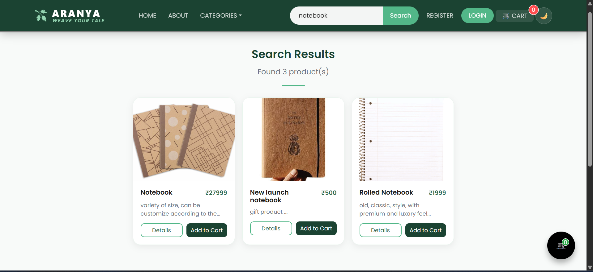
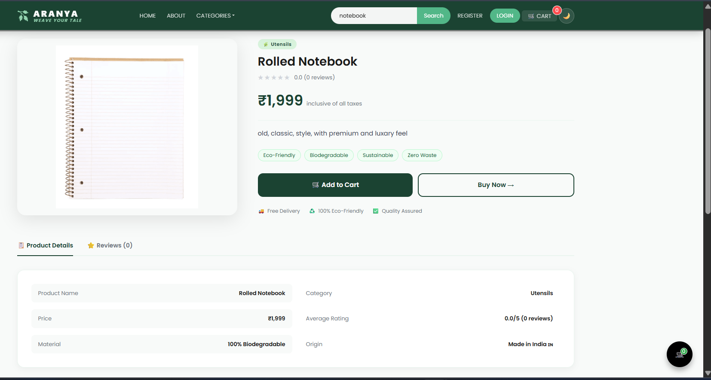
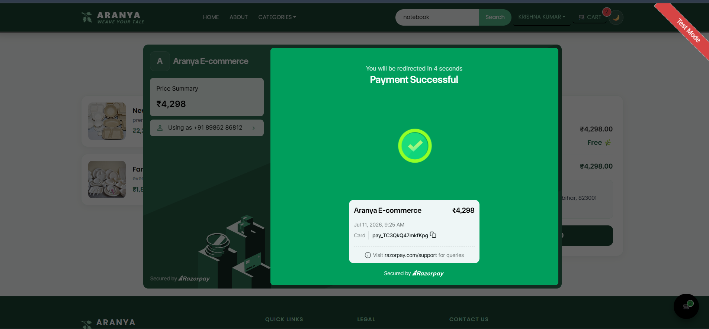
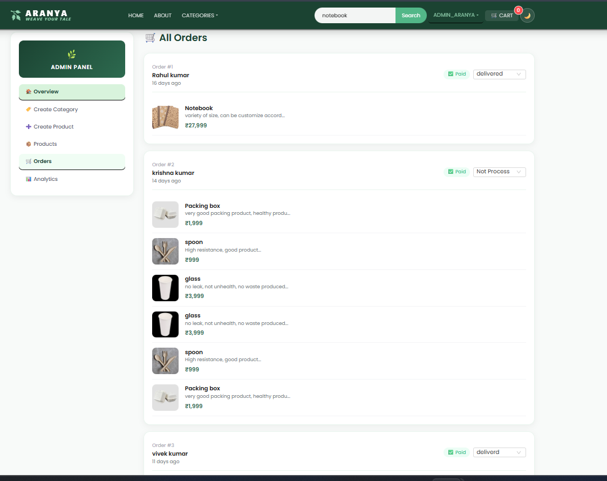
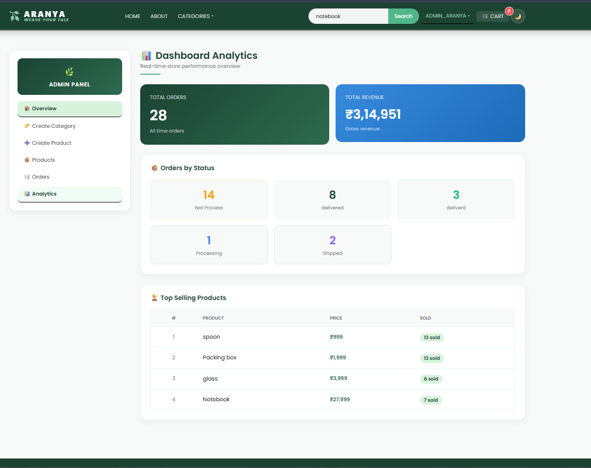

<!-- # 🌿 Aranya — Eco-Friendly E-Commerce Platform

A production-grade full-stack e-commerce platform built with the MERN stack, featuring real-time order tracking, Redis caching, and secure payment processing.

## 🔗 Live Demo
**[View Live →](https://aranya-production.up.railway.app)**

## 📸 Screenshots

| Home | Product |
|------|---------|
|  |  |

| Cart | Admin Dashboard |
|------|-----------------|
|  |  |


## ⚡ Key Features
- **Redis Caching** — 20x faster API response time on product listings
- **Real-time Order Tracking** — Socket.io WebSockets (like Swiggy/Zomato)
- **JWT Refresh Token System** — Secure auth with httpOnly cookies, 15min access tokens
- **Cloudinary Image Upload** — Production-grade image storage (not in DB)
- **Razorpay Payment** — With idempotency check to prevent duplicate orders
- **Email Notifications** — Order confirmation, status updates, delivery alerts via Nodemailer
- **OTP Email Verification** — On registration with 10-min expiry and resend support
- **Admin Analytics Dashboard** — MongoDB Aggregation Pipeline (revenue, top products, order status)
- **Zod Validation** — Backend + frontend validation with error messages
- **Winston Logging** — Production-level logging to files
- **Soft Delete** — Products hidden not deleted (preserves order history)
- **Per-route Rate Limiting** — Strict 5 req/15min on auth routes (brute-force protection)
- **Product Reviews & Ratings** — With star UI and average calculation

## 🛠 Tech Stack
| Layer | Technology |
|-------|-----------|
| Frontend | React.js, Ant Design, Socket.io-client |
| Backend | Node.js, Express.js |
| Database | MongoDB + Mongoose |
| Cache | Redis (ioredis) |
| Auth | JWT (Access + Refresh tokens) |
| Payments | Razorpay |
| Images | Cloudinary |
| Email | Nodemailer |
| Validation | Zod |
| Logging | Winston |
| Containerization | Docker + docker-compose |

## 🚀 Run Locally

### Prerequisites
- Node.js 20+
- MongoDB
- Redis

### With Docker (Recommended)
```bash
git clone https://github.com/yourusername/aranya
cd aranya
cp .env.example .env  # fill in your values
docker compose up
```

### Without Docker
```bash
# Backend
npm install
npm run dev

# Frontend (new terminal)
cd client
npm install
npm start
```

## 🔑 Environment Variables -->


<!-- # 🌿 Aranya — Eco-Friendly E-Commerce Platform -->
<!--  -->
<!-- <p align="center"> -->
<!--  -->
<!--  -->
<!--  -->
<!--  -->
<!--  -->
<!--  -->
<!--  -->
<!--  -->
<!--  -->
<!--  -->
<!--  -->
<!-- </p> -->
<!--  -->
<!-- <!-- <!-- > A **production-ready full-stack MERN E-Commerce Platform** built with modern web technologies, secure authentication, Redis caching, Cloudinary media storage, Docker support, email verification, admin analytics, and scalable backend architecture. --> --> -->
<!--  -->
<!-- --- -->
<!--  -->
<!-- # 🚀 Project Highlights -->
<!--  -->
<!-- <!-- Unlike a basic CRUD e-commerce project, **Aranya** focuses on building a production-style application using industry practices. --> -->
<!--  -->
<!-- ### Key Highlights -->
<!--  -->
<!-- - 🔐 Secure JWT Authentication -->
<!-- - 🔄 Refresh Token Authentication -->
<!-- - 📧 Email OTP Verification -->
<!-- - ⚡ Redis Server-side Caching -->
<!-- - ☁️ Cloudinary Image Storage -->
<!-- - 📦 Docker Support -->
<!-- - 📊 Admin Analytics Dashboard -->
<!-- - ⭐ Product Reviews & Ratings -->
<!-- - 💳 Razorpay Payment Integration -->
<!-- - 🔍 Product Search & Filters -->
<!-- - 📂 Category Management -->
<!-- - 📱 Responsive UI -->
<!-- - 📝 Winston Logging -->
<!-- - ✅ Zod Validation -->
<!-- - 📩 Email Notifications -->
<!-- - 🛡 Protected Admin/User Routes -->
<!--  -->
<!-- --- -->
<!--  -->
<!-- # 🎯 Why This Project? -->
<!--  -->
<!-- <!-- This project was built to simulate a real-world production e-commerce platform instead of a simple college CRUD application. --> -->
<!--  -->
<!-- The application demonstrates concepts commonly used in modern software engineering, including: -->
<!--  -->
<!-- - Authentication & Authorization -->
<!-- - REST API Design -->
<!-- - Redis Caching -->
<!-- - Docker Containerization -->
<!-- - Cloud Image Storage -->
<!-- - Secure Payment Processing -->
<!-- - Backend Validation -->
<!-- - Logging & Monitoring -->
<!-- - Scalable Folder Architecture -->
<!-- - Admin Analytics -->
<!-- - Production Deployment Ready Structure -->
<!--  -->
<!-- --- -->
<!--  -->
<!-- # ✨ Features -->
<!--  -->
<!-- ## 👤 Authentication -->
<!--  -->
<!-- - JWT Login -->
<!-- - Secure Registration -->
<!-- - Password Hashing using Bcrypt -->
<!-- - Refresh Token Authentication -->
<!-- - HTTP Only Cookies -->
<!-- - Protected Routes -->
<!-- - Role-based Authorization -->
<!-- - Email OTP Verification -->
<!-- - Resend OTP Support -->
<!--  -->
<!-- --- -->
<!--  -->
<!-- ## 🛍 Product Features -->
<!--  -->
<!-- - Product Listing -->
<!-- - Product Details -->
<!-- - Category Filter -->
<!-- - Product Search -->
<!-- - Pagination -->
<!-- - Related Products -->
<!-- - Product Reviews -->
<!-- - Product Ratings -->
<!-- - Product Images via Cloudinary -->
<!--  -->
<!-- --- -->
<!--  -->
<!-- ## 🛒 Shopping Features -->
<!--  -->
<!-- - Shopping Cart -->
<!-- - Quantity Update -->
<!-- - Remove from Cart -->
<!-- - Checkout Flow -->
<!-- - Razorpay Payment -->
<!-- - Order Placement -->
<!-- - Order History -->
<!--  -->
<!-- --- -->
<!--  -->
<!-- ## 👨‍💼 Admin Features -->
<!--  -->
<!-- - Admin Dashboard -->
<!-- - Product Management -->
<!-- - Category Management -->
<!-- - Order Management -->
<!-- - Revenue Analytics -->
<!-- - Product Analytics -->
<!-- - User Statistics -->
<!--  -->
<!-- --- -->
<!--  -->
<!-- ## ⚙ Backend Features -->
<!--  -->
<!-- - Redis Caching -->
<!-- - Cloudinary Integration -->
<!-- - Nodemailer -->
<!-- - Winston Logger -->
<!-- - Zod Validation -->
<!-- - REST APIs -->
<!-- - Docker Support -->
<!-- - Environment Configuration -->
<!-- - Error Handling -->
<!-- - Secure Middleware -->
<!--  -->
<!-- --- -->
<!--  -->
<!-- # 🛠 Tech Stack -->
<!--  -->
<!-- | Category | Technologies | -->
<!-- |----------|--------------| -->
<!-- | Frontend | React.js, React Router DOM, Axios, Context API, Ant Design, Bootstrap | -->
<!-- | Backend | Node.js, Express.js | -->
<!-- | Database | MongoDB, Mongoose | -->
<!-- | Cache | Redis (ioredis) | -->
<!-- | Authentication | JWT, Bcrypt, HTTP Only Cookies | -->
<!-- | Image Storage | Cloudinary | -->
<!-- | Payment Gateway | Razorpay | -->
<!-- | Email Service | Nodemailer | -->
<!-- | Validation | Zod | -->
<!-- | Logging | Winston | -->
<!-- | Containerization | Docker, Docker Compose | -->
<!-- | Version Control | Git & GitHub | -->
<!--  -->
<!-- --- -->
<!--  -->
<!-- # 🏗 System Architecture -->
<!--  -->
<!-- ```text -->
                    <!-- React Frontend -->
                           <!-- │ -->
                           <!-- │ -->
                   <!-- REST API (Axios) -->
                           <!-- │ -->
                           <!-- ▼ -->
                 <!-- Express.js Backend -->
                           <!-- │ -->
      <!-- ┌────────────────────┼────────────────────┐ -->
      <!-- │                    │                    │ -->
      <!-- ▼                    ▼                    ▼ -->
 <!-- MongoDB              Redis Cache         Cloudinary -->
<!-- (Database)         (Fast API Cache)      (Image Storage) -->
      <!-- │ -->
      <!-- ▼ -->
 <!-- JWT Authentication -->
      <!-- │ -->
      <!-- ▼ -->
 <!-- Protected APIs -->
      <!-- │ -->
      <!-- ▼ -->
 <!-- Razorpay + Email Notifications -->
<!-- ``` -->
<!--  -->
<!-- --- -->
<!--  -->
<!-- # 📂 Project Structure -->
<!--  -->
<!-- ```text -->
<!-- Aranya-Ecommerce -->
<!-- │ -->
<!-- ├── client/ -->
<!-- │   ├── public/ -->
<!-- │   ├── src/ -->
<!-- │   │   ├── components/ -->
<!-- │   │   ├── context/ -->
<!-- │   │   ├── hooks/ -->
<!-- │   │   ├── pages/ -->
<!-- │   │   ├── styles/ -->
<!-- │   │   └── App.js -->
<!-- │ -->
<!-- ├── config/ -->
<!-- │   ├── db.js -->
<!-- │   ├── redis.js -->
<!-- │   ├── cloudinary.js -->
<!-- │   ├── email.js -->
<!-- │   └── logger.js -->
<!-- │ -->
<!-- ├── controllers/ -->
<!-- ├── middlewares/ -->
<!-- ├── helpers/ -->
<!-- ├── models/ -->
<!-- ├── routes/ -->
<!-- ├── tests/ -->
<!-- ├── docs/ -->
<!-- │ -->
<!-- ├── Dockerfile -->
<!-- ├── docker-compose.yml -->
<!-- ├── package.json -->
<!-- ├── server.js -->
<!-- └── README.md -->
<!-- ``` -->
<!--  -->
<!-- --- -->
<!--  -->
<!-- # 🚀 Getting Started -->
<!--  -->
<!-- ## Prerequisites -->
<!--  -->
<!-- Before running the project, ensure you have installed: -->
<!--  -->
<!-- - Node.js (v18 or above) -->
<!-- - MongoDB -->
<!-- - Redis -->
<!-- - Git -->
<!-- - Docker (Optional) -->
<!--  -->
<!-- --- -->
<!--  -->
<!-- # 📥 Clone Repository -->
<!--  -->
<!-- ```bash -->
git clone https://github.com/krish8986/Aranya-Ecommerce.git

cd Aranya-Ecommerce
<!-- ``` -->
<!--  -->
<!-- --- -->
<!--  -->
<!-- # 📦 Install Dependencies -->
<!--  -->
<!-- ### Backend -->
<!--  -->
<!-- ```bash -->
npm install
<!-- ``` -->
<!--  -->
<!-- ### Frontend -->
<!--  -->
<!-- ```bash -->
cd client

npm install
<!-- ``` -->
<!--  -->
<!-- --- -->
<!--  -->
<!-- # ▶ Run the Application -->
<!--  -->
<!-- ## Backend -->
<!--  -->
<!-- ```bash -->
npm run server
<!-- ``` -->
<!--  -->
<!-- or -->
<!--  -->
<!-- ```bash -->
npm run dev
<!-- ``` -->
<!--  -->
<!-- --- -->
<!--  -->
<!-- ## Frontend -->
<!--  -->
<!-- ```bash -->
cd client

npm start
<!-- ``` -->
<!--  -->
<!-- --- -->
<!--  -->
<!-- ## Run Full Stack -->
<!--  -->
<!-- ```bash -->
npm run dev
<!-- ``` -->
<!--  -->
<!-- --- -->
<!--  -->
<!-- # 🐳 Docker Support -->
<!--  -->
<!-- Build and start the complete application: -->
<!--  -->
<!-- ```bash -->
docker compose up --build
<!-- ``` -->
<!--  -->
<!-- Run in background: -->
<!--  -->
<!-- ```bash -->
docker compose up -d
<!-- ``` -->
<!--  -->
<!-- Stop containers: -->
<!--  -->
<!-- ```bash -->
docker compose down
<!-- ``` -->
<!--  -->
<!-- --- -->
<!--  -->
<!-- # 🔐 Environment Variables -->
<!--  -->
<!-- Create a `.env` file in the project root. -->
<!--  -->
<!-- Example: -->
<!--  -->
<!-- ```env -->
<!-- PORT=8000 -->
<!--  -->
<!-- MONGO_URL= -->
<!--  -->
<!-- JWT_SECRET= -->
<!--  -->
<!-- JWT_REFRESH_SECRET= -->
<!--  -->
<!-- REDIS_URL= -->
<!--  -->
<!-- CLIENT_URL=http://localhost:3000 -->
<!--  -->
<!-- EMAIL= -->
<!--  -->
<!-- EMAIL_PASSWORD= -->
<!--  -->
<!-- CLOUDINARY_CLOUD_NAME= -->
<!--  -->
<!-- CLOUDINARY_API_KEY= -->
<!--  -->
<!-- CLOUDINARY_API_SECRET= -->
<!--  -->
<!-- RAZORPAY_KEY_ID= -->
<!--  -->
<!-- RAZORPAY_SECRET= -->
<!-- ``` -->
<!--  -->
<!-- --- -->
<!--  -->
<!-- # 📡 API Highlights -->
<!--  -->
<!-- The backend follows a RESTful API architecture. -->
<!--  -->
<!-- ### Authentication APIs -->
<!--  -->
<!-- - User Registration -->
<!-- - User Login -->
<!-- - Refresh Access Token -->
<!-- - Logout -->
<!-- - Email OTP Verification -->
<!-- - Resend OTP -->
<!--  -->
<!-- --- -->
<!--  -->
<!-- ### Product APIs -->
<!--  -->
<!-- - Get All Products -->
<!-- - Get Single Product -->
<!-- - Create Product -->
<!-- - Update Product -->
<!-- - Delete Product (Soft Delete) -->
<!-- - Product Search -->
<!-- - Product Filter -->
<!-- - Related Products -->
<!-- - Product Reviews -->
<!--  -->
<!-- --- -->
<!--  -->
<!-- ### Category APIs -->
<!--  -->
<!-- - Create Category -->
<!-- - Update Category -->
<!-- - Delete Category -->
<!-- - Get Categories -->
<!--  -->
<!-- --- -->
<!--  -->
<!-- ### Order APIs -->
<!--  -->
<!-- - Place Order -->
<!-- - Get User Orders -->
<!-- - Get All Orders (Admin) -->
<!-- - Update Order Status -->
<!--  -->
<!-- --- -->
<!--  -->
<!-- ### Payment APIs -->
<!--  -->
<!-- - Razorpay Order Creation -->
<!-- - Payment Verification -->
<!--  -->
<!-- --- -->
<!--  -->
<!-- ### Analytics APIs -->
<!--  -->
<!-- - Revenue Analytics -->
<!-- - Top Selling Products -->
<!-- - Orders by Status -->
<!-- - Dashboard Statistics -->
<!--  -->
<!-- --- -->
<!--  -->
<!-- # 🔒 Security Features -->
<!--  -->
<!-- The project follows several security best practices. -->
<!--  -->
<!-- - JWT Authentication -->
<!-- - Refresh Token Authentication -->
<!-- - HTTP Only Cookies -->
<!-- - Password Hashing using Bcrypt -->
<!-- - Protected Routes -->
<!-- - Role-based Authorization -->
<!-- - Environment Variables -->
<!-- - Zod Request Validation -->
<!-- - Centralized Error Handling -->
<!-- - Input Validation -->
<!-- - Secure Payment Verification -->
<!--  -->
<!-- --- -->
<!--  -->
<!-- # ⚡ Performance Optimizations -->
<!--  -->
<!-- <!-- Instead of serving every request directly from MongoDB, the application improves performance using caching and optimized backend architecture. --> -->
<!--  -->
<!-- ### Redis Caching -->
<!--  -->
<!-- - Frequently accessed product listings are served from Redis cache. -->
<!-- - Reduces unnecessary database queries. -->
<!-- - Improves response time for repeated requests. -->
<!--  -->
<!-- --- -->
<!--  -->
<!-- ### Cloudinary -->
<!--  -->
<!-- - Images are stored on Cloudinary instead of MongoDB. -->
<!-- - Faster media delivery. -->
<!-- - Reduced database size. -->
<!--  -->
<!-- --- -->
<!--  -->
<!-- ### Docker -->
<!--  -->
<!-- - Easy local development. -->
<!-- - Consistent development environment. -->
<!-- - One-command project setup. -->
<!--  -->
<!-- --- -->
<!--  -->
<!-- # 🧪 Testing -->
<!--  -->
<!-- The project includes API testing for important backend routes. -->
<!--  -->
<!-- Example tested routes: -->
<!--  -->
<!-- - Register -->
<!-- - Login -->
<!-- - Product Listing -->
<!--  -->
<!-- Run tests using: -->
<!--  -->
<!-- ```bash -->
npm test
<!-- ``` -->
<!--  -->
<!-- --- -->
<!--  -->
<!-- # 📸 Screenshots -->
<!--  -->
<!-- ## 📸 Screenshots -->
<!--  -->
<!-- ### 🏠 Home Page -->
<!--  -->
<!--  -->
<!-- ### 🛍️ Products -->
<!--  -->
<!--  -->
<!-- ### 📦 Product Details -->
<!--  -->
<!--  -->
<!-- ### 🛒 Shopping Cart -->
<!--  -->
<!--  -->
<!-- ### 📊 Admin Dashboard -->
<!--  -->
<!--  -->
<!-- ### ⚙️ Admin Products -->
<!--  -->
<!--  -->

<!-- Example: -->
<!--  -->
<!-- ```text -->
<!-- docs/ -->
<!-- └── screenshots/ -->
    <!-- ├── home.png -->
    <!-- ├── products.png -->
    <!-- ├── cart.png -->
    <!-- ├── login.png -->
    <!-- ├── admin-dashboard.png -->
    <!-- └── analytics.png -->
<!-- ``` -->
<!--  -->
<!-- --- -->
<!--  -->
<!-- # 🚀 Deployment -->
<!--  -->
<!-- The project is deployment-ready. -->
<!--  -->
<!-- ### Frontend -->
<!--  -->
<!-- - Vercel -->
<!--  -->
<!-- ### Backend -->
<!--  -->
<!-- - Railway -->
<!-- or -->
<!-- - Render -->
<!--  -->
<!-- ### Database -->
<!--  -->
<!-- - MongoDB Atlas -->
<!--  -->
<!-- ### Cache -->
<!--  -->
<!-- - Redis Cloud -->
<!--  -->
<!-- ### Image Storage -->
<!--  -->
<!-- - Cloudinary -->
<!--  -->
<!-- --- -->
<!--  -->
<!-- # 🌟 Production Features -->
<!--  -->
<!-- This project includes production-oriented features commonly used in scalable applications. -->
<!--  -->
<!-- - Docker Containerization -->
<!-- - Redis Caching -->
<!-- - Cloudinary Storage -->
<!-- - Secure Authentication -->
<!-- - Email Verification -->
<!-- - Logging -->
<!-- - Validation -->
<!-- - Payment Gateway -->
<!-- - Analytics Dashboard -->
<!-- - Environment Configuration -->
<!-- - RESTful APIs -->
<!-- - Modular Architecture -->
<!--  -->
<!-- --- -->
<!--  -->
<!-- # 🛣 Roadmap -->
<!--  -->
<!-- The following features are planned for future releases. -->
<!--  -->
<!-- - AI Product Recommendation System -->
<!-- - Wishlist -->
<!-- - Coupon & Discount System -->
<!-- - Inventory Management -->
<!-- - Sales Reports -->
<!-- - Multi-vendor Marketplace -->
<!-- - Progressive Web App (PWA) -->
<!-- - Multi-language Support -->
<!-- - Dark Mode -->
<!-- - Product Comparison -->
<!-- - Notification Center -->
<!-- - Advanced Search Filters -->
<!-- - Recommendation Engine -->
<!--  -->
<!-- --- -->
<!--  -->
<!-- # 🤝 Contributing -->
<!--  -->
<!-- Contributions are welcome! -->
<!--  -->
<!-- If you'd like to improve this project: -->
<!--  -->
<!-- 1. Fork the repository -->
<!-- 2. Create your feature branch -->
<!--  -->
<!-- ```bash -->
git checkout -b feature/NewFeature
<!-- ``` -->
<!--  -->
<!-- 3. Commit your changes -->
<!--  -->
<!-- ```bash -->
git commit -m "Add new feature"
<!-- ``` -->
<!--  -->
<!-- 4. Push your branch -->
<!--  -->
<!-- ```bash -->
git push origin feature/NewFeature
<!-- ``` -->
<!--  -->
<!-- 5. Open a Pull Request -->
<!--  -->
<!-- --- -->
<!--  -->
<!-- # 💡 Learning Outcomes -->
<!--  -->
<!-- This project helped strengthen practical understanding of: -->
<!--  -->
<!-- - Full Stack MERN Development -->
<!-- - REST API Design -->
<!-- - Authentication & Authorization -->
<!-- - Refresh Token Flow -->
<!-- - Redis Caching -->
<!-- - Docker Containerization -->
<!-- - MongoDB Aggregation -->
<!-- - Cloudinary Integration -->
<!-- - Email Services -->
<!-- - Backend Validation -->
<!-- - Logging & Error Handling -->
<!-- - Payment Gateway Integration -->
<!-- - Scalable Project Structure -->
<!--  -->
<!-- --- -->
<!--  -->
<!-- # 📈 Project Status -->
<!--  -->
<!-- ✅ Active Development -->
<!--  -->
<!-- Recent additions include: -->
<!--  -->
<!-- - Redis Integration -->
<!-- - Docker Support -->
<!-- - Cloudinary Storage -->
<!-- - Email OTP Verification -->
<!-- - Admin Analytics Dashboard -->
<!-- - Product Reviews & Ratings -->
<!-- - Winston Logger -->
<!-- - Zod Validation -->
<!-- - Improved UI -->
<!-- - Hero Carousel -->
<!-- - API Testing -->
<!--  -->
<!-- Future updates will continue improving scalability, performance, and user experience. -->
<!--  -->
<!-- --- -->
<!--  -->
<!-- # 📄 License -->
<!--  -->
<!-- This project is licensed under the MIT License. -->
<!--  -->
<!-- You are free to use, modify, and distribute this project for learning and educational purposes. -->
<!--  -->
<!-- --- -->
<!--  -->
<!-- # 👨‍💻 Author -->
<!--  -->
<!-- ## Krishna Kumar -->
<!--  -->
<!-- **Electronics & Communication Engineering**   -->
<!-- Maharaja Agrasen Institute of Technology (MAIT), Delhi -->
<!--  -->
<!-- ### Connect with me -->
<!--  -->
<!-- - GitHub: https://github.com/krish8986 -->
<!-- - LinkedIn: *(Add your LinkedIn profile here)* -->
<!--  -->
<!-- --- -->
<!--  -->
<!-- # ⭐ Show Your Support -->
<!--  -->
<!-- If you found this project useful, consider giving it a ⭐ on GitHub. -->
<!--  -->
<!-- It helps others discover the project and motivates future improvements. -->
<!--  -->
<!-- --- -->
<!--  -->
<!-- <p align="center"> -->
<!--  -->
<!-- ### 🌿 Building Sustainable Technology for a Better Future 🌿 -->
<!--  -->
<!-- **Made with ❤️ using the MERN Stack** -->
<!--  -->
<!-- </p> -->


# 🌿 Aranya — Production-Ready MERN E-Commerce Platform

<p align="center">


</p>

> A production-ready full-stack MERN e-commerce platform built with modern backend engineering practices including Redis caching, Refresh Token Authentication, OTP Email Verification, Razorpay Payments, Cloudinary media storage, Docker containerization, and Admin Analytics.

---

# 🌐 Live Demo

| Service | Link |
|---------|------|
| 🚀 Frontend | https://aranya-ecommerce-self.vercel.app |
| ⚙ Backend API | https://aranya-ecommerce-production.up.railway.app |
| 💻 GitHub | https://github.com/krish8986/Aranya-Ecommerce |

---

# 📖 About The Project

Aranya is a production-oriented MERN Stack E-Commerce platform built to simulate how modern e-commerce applications are developed in industry.

Instead of focusing only on CRUD functionality, this project emphasizes backend architecture, scalability, security, caching, deployment, authentication, performance optimization, and production best practices.

The application demonstrates concepts commonly expected from Software Engineer and Backend Developer roles.

---

# ✨ Key Features

## 🔐 Authentication

- JWT Authentication
- Refresh Token Authentication
- HTTP Only Cookie Security
- OTP Email Verification
- Forgot Password with OTP
- Password Hashing using bcrypt
- Protected Routes
- Role Based Authorization

---

## 🛒 Shopping

- Product Listing
- Product Details
- Category Filter
- Search Products
- Pagination
- Shopping Cart
- Checkout Flow
- Razorpay Payment Gateway
- Order History

---

## 👨‍💼 Admin

- Product Management
- Category Management
- Order Management
- Revenue Analytics
- Product Analytics
- Dashboard Statistics
- Soft Delete Products

---

## ⚙ Backend Engineering

- Redis Server-side Caching
- Cache Invalidation
- Cloudinary Image Storage
- Email Notifications
- Winston Logging
- Zod Validation
- Rate Limiting
- REST APIs
- Docker Support

---

# 🚀 Production Highlights

Unlike a basic MERN CRUD application, Aranya includes several production-level features.

| Feature | Description |
|----------|-------------|
| Redis Cache | Faster API responses with reduced MongoDB load |
| Refresh Token | Secure authentication using Access + Refresh Tokens |
| Cloudinary | Cloud image storage instead of MongoDB |
| Razorpay | Secure online payments |
| Docker | One-command project setup |
| Analytics | MongoDB Aggregation Pipeline |
| Rate Limiting | Brute-force attack protection |
| Winston | Centralized logging |
| Soft Delete | Preserves order history |
| OTP Verification | Secure account verification |

---

# 🏗 System Architecture

```text
                  React Frontend
                         │
                         │ Axios
                         ▼
                 Express.js Backend
                         │
        ┌──────────┬────────────┬─────────────┐
        │          │            │             │
        ▼          ▼            ▼             ▼
    MongoDB     Redis      Cloudinary     Razorpay
   (Database)   Cache      Image CDN      Payments
        │
        ▼
 JWT Authentication
        │
        ▼
 Refresh Token Flow
        │
        ▼
 Email Notifications
```

---

# 🛠 Tech Stack

| Layer | Technologies |
|-------|--------------|
| Frontend | React.js, React Router DOM, Axios, Context API, Bootstrap, Ant Design |
| Backend | Node.js, Express.js |
| Database | MongoDB, Mongoose |
| Cache | Redis (ioredis) |
| Authentication | JWT, bcrypt, HTTP Only Cookies |
| Payments | Razorpay |
| Media | Cloudinary |
| Email | Nodemailer |
| Validation | Zod |
| Logging | Winston |
| Containerization | Docker & Docker Compose |
| Deployment | Railway + Vercel |

---

# 📂 Project Structure

```text
Aranya-Ecommerce
│
├── client/
│   ├── src/
│   │   ├── components/
│   │   ├── context/
│   │   ├── hooks/
│   │   ├── pages/
│   │   ├── styles/
│   │   └── utils/
│
├── config/
│
├── controllers/
│
├── middlewares/
│
├── models/
│
├── routes/
│
├── helpers/
│
├── tests/
│
├── docs/
│
├── Dockerfile
├── docker-compose.yml
├── package.json
└── server.js
```

---

# ⚡ Performance Optimizations

## Redis Caching

Instead of querying MongoDB on every request, product listing APIs are cached in Redis.

Benefits:

- Faster response time
- Reduced database load
- Better scalability
- Automatic cache invalidation after product updates

---

## Cloudinary

Images are stored in Cloudinary rather than MongoDB.

Benefits:

- Faster image delivery
- CDN support
- Smaller database size
- Better scalability

---

## Soft Delete

Products are hidden instead of permanently deleted.

Benefits:

- Preserves order history
- Maintains analytics
- Prevents broken references

# 🚀 Getting Started

## Prerequisites

Before running the project locally, make sure you have installed:

- Node.js (v18 or later)
- MongoDB
- Redis
- Git
- Docker (Optional but Recommended)

---

## 📥 Clone Repository

```bash
git clone https://github.com/krish8986/Aranya-Ecommerce.git

cd Aranya-Ecommerce
```

---

# 📦 Install Dependencies

## Backend

```bash
npm install
```

## Frontend

```bash
cd client

npm install
```

---

# ▶ Run Locally

## Start Backend

```bash
npm run dev
```

---

## Start Frontend

```bash
cd client

npm start
```

---

## Run Entire Application

```bash
npm run dev
```

---

# 🐳 Docker Support

Run the complete application using Docker.

## Build Containers

```bash
docker compose up --build
```

---

## Run Containers

```bash
docker compose up
```

---

## Run in Background

```bash
docker compose up -d
```

---

## Stop Containers

```bash
docker compose down
```

Docker provides

- Consistent development environment
- One-command setup
- Easy deployment
- Simplified dependency management

---

# 🔐 Environment Variables

Create a `.env` file in the project root.

Example:

```env
PORT=8000

NODE_ENV=production

MONGO_URL=

JWT_SECRET=

JWT_REFRESH_SECRET=

REDIS_URL=

CLIENT_URL=http://localhost:3000

EMAIL_USER=

EMAIL_PASS=

CLOUDINARY_CLOUD_NAME=

CLOUDINARY_API_KEY=

CLOUDINARY_API_SECRET=

RAZORPAY_KEY_ID=

RAZORPAY_SECRET_KEY=
```

---

# 📡 REST API Overview

## Authentication

| Method | Endpoint |
|---------|----------|
| POST | /api/v1/auth/register |
| POST | /api/v1/auth/login |
| POST | /api/v1/auth/verify-otp |
| POST | /api/v1/auth/resend-otp |
| POST | /api/v1/auth/forgot-password |
| POST | /api/v1/auth/refresh-token |

---

## Products

| Method | Endpoint |
|---------|----------|
| GET | /api/v1/product/get-product |
| GET | /api/v1/product/product-list/:page |
| GET | /api/v1/product/product-count |
| GET | /api/v1/product/product-photo/:id |
| POST | /api/v1/product/create-product |
| PUT | /api/v1/product/update-product/:id |
| DELETE | /api/v1/product/delete-product/:id |

---

## Categories

| Method | Endpoint |
|---------|----------|
| GET | /api/v1/category/get-category |
| POST | /api/v1/category/create-category |
| PUT | /api/v1/category/update-category/:id |
| DELETE | /api/v1/category/delete-category/:id |

---

## Orders

| Method | Endpoint |
|---------|----------|
| POST | /api/v1/orders/create |
| GET | /api/v1/auth/orders |
| GET | /api/v1/auth/all-orders |
| PUT | /api/v1/auth/order-status/:id |

---

# 🔒 Security Features

The application follows modern backend security practices.

✅ JWT Authentication

✅ Refresh Token Authentication

✅ HTTP Only Cookies

✅ Password Hashing using bcrypt

✅ Role-based Authorization

✅ OTP Email Verification

✅ Rate Limiting

✅ Zod Request Validation

✅ Secure Razorpay Payment Verification

✅ Environment Variables

---

# ⚡ Performance Optimizations

## Redis Caching

Product listing APIs are cached inside Redis.

Benefits

- Reduced MongoDB Queries
- Faster API Response
- Better Scalability
- Automatic Cache Invalidation

---

## Cloudinary

Instead of storing images inside MongoDB,

Images are uploaded to Cloudinary.

Benefits

- CDN Delivery
- Faster Loading
- Smaller Database
- Better Performance

---

## Refresh Token Authentication

Access Token

- 15 Minutes

Refresh Token

- 7 Days

Benefits

- Better Security
- Improved User Experience
- Reduced Login Requests

---

# 🧪 Testing

The backend APIs are tested using

- Jest
- Supertest

Test Coverage includes

- Registration
- Login
- Product APIs
- Validation
- Error Responses

Run Tests

```bash
npm test
```

---

# 🚀 Deployment

| Service | Platform |
|----------|----------|
| Frontend | Vercel |
| Backend | Railway |
| Database | MongoDB Atlas |
| Redis | Railway Redis |
| Image Storage | Cloudinary |
| Payments | Razorpay |

---

# 📸 Screenshots

## Home


---

## Search



---

## Products


---

## Product Details



---

## Cart


---

## Payment



---

## Admin Dashboard


---

## Admin Products


---

## Admin Orders



---

## Analytics



---

###    Jest + Supertest / API Testing


---


# 🎥 Demo Video

Watch the complete project walkthrough

👉 Add Loom / YouTube Link Here

The demo covers

- Authentication
- Product Management
- Redis Cache
- Payment Flow
- Admin Dashboard
- Analytics
- Docker
- Deployment

---

# 💡 Technical Decisions

Instead of choosing technologies randomly, every major architectural decision in this project was made to solve a real engineering problem.

| Decision | Why this approach? |
|-----------|--------------------|
| Redis Cache | Reduce MongoDB load and improve response time for frequently accessed product APIs. |
| Cache Invalidation | Automatically clears Redis cache whenever products are created, updated, or deleted to prevent stale data. |
| Refresh Tokens | Short-lived access tokens improve security while refresh tokens provide a seamless user experience. |
| HTTP Only Cookies | Protect refresh tokens from JavaScript access and reduce XSS risks. |
| Cloudinary | Image hosting is delegated to Cloudinary instead of storing binary files inside MongoDB. |
| Soft Delete | Products are hidden instead of permanently removed so previous orders remain valid. |
| MongoDB Aggregation | Used for revenue analytics and dashboard statistics without unnecessary backend processing. |
| Docker | Ensures every developer gets the same environment with one command. |
| Winston Logger | Centralized logging instead of scattered console.log statements. |
| Zod Validation | Prevents invalid requests before business logic executes. |
| Rate Limiting | Protects authentication endpoints from brute-force attacks. |
| Socket.io | Enables real-time order status updates without page refresh. |

---

# 🚧 Engineering Challenges Solved

During development, several real-world problems were encountered and resolved.

## Redis Cache Invalidation

### Problem

After creating a new product, old product data continued to appear because Redis was still serving cached responses.

### Solution

Implemented automatic cache invalidation whenever products are:

- Created
- Updated
- Deleted

This ensures users always receive fresh data while still benefiting from Redis performance.

---

## Refresh Token Authentication

### Problem

Users were being logged out after JWT expiration.

### Solution

Implemented:

- 15-minute Access Tokens
- 7-day Refresh Tokens
- Automatic token refresh
- HTTP Only Cookies

Result:

Users remain logged in securely without repeatedly entering credentials.

---

## Railway Deployment

### Problem

SMTP email delivery was inconsistent after deployment.

### Solution

Configured Railway environment variables correctly, verified SMTP connectivity, and implemented better email error handling with retries.

---

## Cloudinary Migration

### Problem

Storing images directly inside MongoDB increases database size and affects performance.

### Solution

Migrated product images to Cloudinary.

Benefits:

- Faster delivery
- CDN support
- Smaller database
- Better scalability

---

## Dockerized Development

The application was containerized using Docker and Docker Compose to simplify local development.

Benefits:

- One-command setup
- Same environment across systems
- Easier onboarding
- Deployment-ready configuration

---

# 📈 Performance Improvements

| Feature | Improvement |
|----------|-------------|
| Redis Cache | Reduced repeated MongoDB queries |
| Cloudinary CDN | Faster image loading |
| Pagination | Reduced payload size |
| Lazy Loading | Improved frontend rendering |
| Rate Limiter | Reduced malicious traffic |
| Refresh Tokens | Better user experience |
| Docker | Faster project setup |

---

# 🧠 What I Learned

This project strengthened my understanding of:

- Full Stack MERN Development
- Backend Architecture
- REST API Design
- Authentication & Authorization
- Refresh Token Flow
- Redis Caching
- Docker
- Cloudinary
- Razorpay Integration
- MongoDB Aggregation Pipeline
- Rate Limiting
- Logging & Monitoring
- Deployment
- Production Debugging
- Cache Invalidation
- Secure Payment Verification

---

# 🎯 Interview Discussion Topics

This project demonstrates several backend engineering concepts that are frequently discussed in software engineering interviews.

- JWT Authentication
- Refresh Token Flow
- Redis Caching
- Cache Invalidation
- MongoDB Aggregation
- Docker Containerization
- Cloudinary Integration
- Payment Gateway Integration
- REST API Design
- Authentication Security
- Role Based Authorization
- Rate Limiting
- Soft Delete Pattern
- Logging
- Production Deployment
- Performance Optimization

---

# 🚀 Future Improvements

The following features are planned for future releases.

- AI Product Recommendation System
- Wishlist
- Coupon & Discount Engine
- Inventory Management
- Sales Reports
- Progressive Web App (PWA)
- Push Notifications
- Multi-language Support
- Dark Mode
- Product Comparison
- Elasticsearch-based Search
- Microservices Migration
- CI/CD Pipeline using GitHub Actions
- Kubernetes Deployment
- Unit + Integration Test Coverage Expansion

---

# 👨‍💻 Author

## Krishna Kumar

**B.Tech — Electronics & Communication Engineering**

**Maharaja Agrasen Institute of Technology (MAIT), GGSIPU**

### Connect With Me

- 💻 GitHub: https://github.com/krish8986
- 💼 LinkedIn: https://www.linkedin.com/in/krishna-kumar-7558a1229
- 🌐 Portfolio: https://68a81d12b665dedf24c2ad37--teal-mermaid-bd6f9b.netlify.app

---

# 📄 License

This project is licensed under the MIT License.

You are free to use, modify, and distribute it for educational purposes.

---

# ⭐ Support

If you found this project helpful,

please consider giving it a ⭐ on GitHub.

It motivates further improvements and helps others discover the project.

---

<p align="center">

## 🌿 Building Sustainable Technology for a Better Future

Production-grade backend engineering with the MERN Stack.

Made with ❤️ by Krishna Kumar

</p>